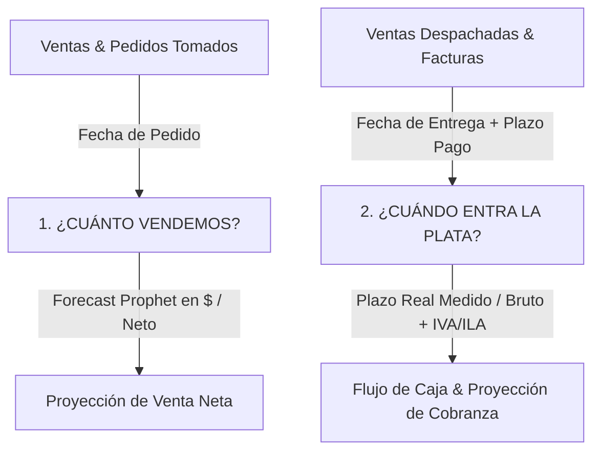

# 01 — Resumen Ejecutivo y Dominio de Negocio (Módulo de Administración y Finanzas)

## Visión General
El módulo de **Administración y Finanzas** (`app/administracion`) gestiona la planificación financiera, la previsión de ingresos monetarios (Forecasting en $), el flujo de caja semanal de 13 semanas, la cobranza y aging de cartera de deudores, y el comportamiento real de pago de los clientes basado en datos de tesorería y ERP.

El módulo responde a dos preguntas centrales que guían la toma de decisiones financieras:

---

## 1. Las Dos Preguntas Financieras

### 1. ¿Cuánto vendemos? (Proyección de Venta Neta)
- **Unidad**: Monto Neto (`total_sin_impuesto`, "Total s/imp $" en el ERP).
- **Ancla temporal**: **Fecha de Pedido** (`fecha_pedido`).
- **Motivo**: Es la señal más temprana de demanda comercial y mantiene al módulo sincronizado con el ciclo comercial interno de producción (del 24 al 23).
- **Motor**: Modelos de Machine Learning (Prophet) entrenados a nivel general, por categoría (Cerveza, Kombucha), cliente individual (PDV) y restaurante BaseCamp.

### 2. ¿Cuándo entra esa plata? (Proyección de Caja y Cobranza)
- **Unidad**: Monto Bruto (Neto + IVA + ILA en cerveza, calculado mediante `brutoLinea()`).
- **Ancla temporal**: **Fecha de Entrega / Despacho** (`fecha_entrega`).
- **Motivo**: El plazo de crédito del cliente empieza a correr cuando la mercadería se entrega y factura, no cuando se toma el pedido.

---

## 2. Neto vs. Bruto en Finanzas

| Dimensión | Tipo de Monto | Impuestos Incluidos | Uso Principal |
| :--- | :--- | :--- | :--- |
| **Venta / Forecast** | **Neto** (`total_sin_impuesto`) | Ninguno | Medición de venta real, comisiones, comparaciones de catálogo. |
| **Flujo de Caja / Tesorería** | **Bruto** (`brutoLinea`) | Neto + IVA (19%) + ILA (cerveza) | Dinero real que ingresa o se requiere en las cuentas bancarias. |

---

## 3. Clasificación de Clientes e Ingresos Reales

No todos los registros de la base de datos de ventas son ingresos comerciales normales. El módulo aplica filtros específicos mediante `esIngresoReal()` y `esClienteExcluidoFinanzas()`:

1. **Ingresos Reales Validados**:
   - Venta comercial de la fuerza de ventas.
   - Venta de mostrador (PDV).
   - Restaurante BaseCamp (POS Toteat).
   - Ferias y eventos.
   - Maquila a terceros (ej. EWU Ginger Beer).
2. **Exclusiones Financieras**:
   - Consumo interno sin valor de flujo (mermas, muestras, degustaciones, control de calidad).
   - Tours a la planta (servicios no operacionales).
