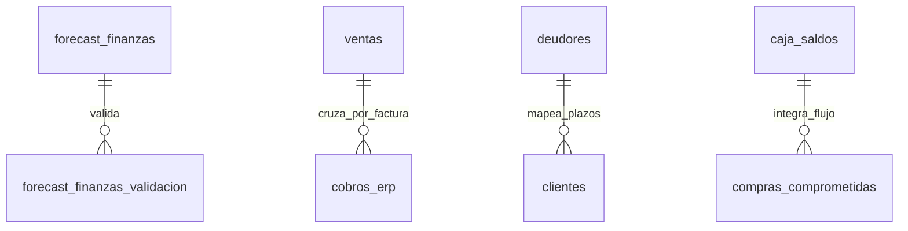

# 02 — Arquitectura y Modelos de Datos (Módulo de Administración y Finanzas)

## Tablas de Supabase Relacionadas



### 1. `forecast_finanzas` & `forecast_finanzas_validacion`
- **Propósito**: Almacena las proyecciones de venta en CLP ($) por ciclo interno comercial.
- **Niveles**: `general`, `categoria` (Cerveza/Kombucha), `cliente` (PDV), `restaurante`, `compra`.
- **Campos principales**: `nivel`, `clave`, `mes`, `tipo`, `monto`, `monto_min`, `monto_max`, `tendencia`, `estacionalidad`.

### 2. `cobros_erp`
- **Propósito**: Registro de los movimientos reales de Cta. Cte. e ingresos a banco procesados desde el ERP.
- **RPCs clave asociados**:
  - `cobros_por_semana(p_desde)`: Agrupa cobros reales por semana y método de pago (transferencia, cheque, efectivo).
  - `comportamiento_pago_clientes(p_min_muestras)`: Mide los días reales de pago por cliente (percentiles p50, p75, p90, promedio).
  - `facturas_impagas(p_desde)`: Retorna las facturas despachadas que aún no figuran pagadas en `cobros_erp`.
  - `cobro_mostrador_semanal(p_semanas)`: Promedio semanal reciente de ventas contado de mostrador.

### 3. `deudores`
- **Propósito**: Cartera de clientes con saldos pendientes y antigüedad de deuda extraída del ERP.
- **Campos de aging**: `deuda_vencida`, `saldo_total`, `deuda_menor_14_dias`, `deuda_entre_15_29_dias`, `deuda_entre_30_44_dias`, `deuda_entre_45_59_dias`, `deuda_entre_60_89_dias`, `deuda_mas_90_dias`.

### 4. `caja_saldos` y `compras_comprometidas`
- **`caja_saldos`**: Saldo bancario real cargado manualmente (`fecha`, `saldo`).
- **`compras_comprometidas`**: Compromisos de pago con proveedores (`monto`, `fecha_pago`, `fecha_documento`, `estado`).

---

## Interfaces TypeScript Principales (`app/administracion/page.tsx` & `lib/administracion/`)

```typescript
export interface DatosFlujo {
  semanas: SemanaFlujo[]
  saldoActual: { fecha: string; saldo: number } | null
  saldoPrevio: { fecha: string; saldo: number } | null
  aging: { tramos: TramoAging[]; total: number }
  riesgo: ClienteRiesgo[]
  ciclo: CicloConversion
  clientesFiltro: string[]
  confirmadoPorClienteSemana: Record<string, number>
  backlogPorClienteSemana: Record<string, number>
  hayCompras: boolean
}

export interface SemanaFlujo {
  inicio: string // Lunes yyyy-mm-dd
  pasada: boolean
  actual: boolean
  ingresosConfirmados: number // Ventas despachadas
  ingresosProyectados: number   // Backlog + Remanente Forecast
  comprasReales: number
  comprasProyectadas: number
  flujoNeto: number
  saldoAcumulado: number
  deficit: boolean
}

export interface ProyeccionCaja {
  periodos: PeriodoCaja[]
  porCliente: ClientePorCobrar[]
  sinPlazo: { neto: number; bruto: number; filas: number; clientes: string[] }
  sinDespachar: { neto: number; bruto: number; filas: number }
  totalProyectado: { neto: number; bruto: number }
}

export interface DatosCobros {
  hayDatos: boolean
  semanas: SemanaCobro[]
  comportamiento: ComportamientoPago[]
  totalUltimas4: number
  totalPrevias4: number
  promedioSemanal: number
  medianaGlobal: number | null
  declaradaGlobal: number | null
  ultimaFecha: string | null
  proyeccion: ProyeccionCobros
}
```
