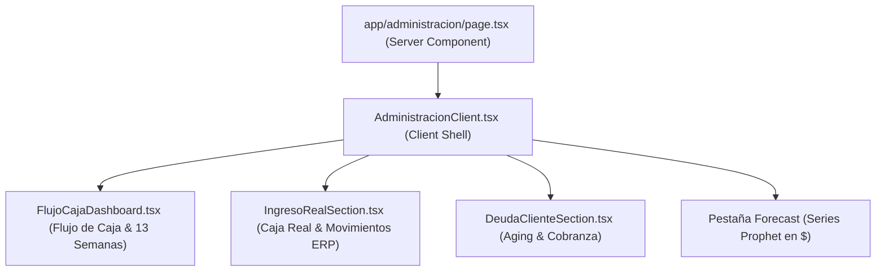

# 04 — Componentes y Vistas (Módulo de Administración y Finanzas)

## Mapa de Componentes y Páginas

---

## Estructura de Componentes

### 1. `app/administracion/page.tsx`
- **Rol**: Server Component con `export const dynamic = 'force-dynamic'`.
- **Responsabilidad**:
  - Verifica sesión del usuario y permisos de Administrador (`user.isAdmin`).
  - Carga en paralelo mediante `Promise.all` el forecast de finanzas, ventas de los últimos 120 días, cartera de deudores, movimientos de cobros del ERP, compras comprometidas y saldos de caja.
  - Ejecuta las funciones puras `construirFlujoSemanal()`, `proyectarCaja()`, `proyectarCobros()`, `calcularAging()` y `semaforoClientes()`.

### 2. `AdministracionClient.tsx`
- **Rol**: Componente cliente principal con gestión de pestañas.
- **Pestañas disponibles**:
  1. **Flujo de Caja**: Visualización del gráfico de 13 semanas rodantes, balance de ingresos confirmados/proyectados vs. egresos de compras, y saldo acumulado.
  2. **Ingreso Real**: Análisis de la caja efectiva procesada en `cobros_erp`, desglose por método de pago (transferencia, cheque, efectivo) y comportamiento de pago por cliente.
  3. **Cobranza y Deuda**: aging de cartera, semáforo de riesgo por cliente y gestión de deudores vencidos.
  4. **Forecast Finanzas**: Curvas de proyección de ventas netas en CLP ($) por categoría y cliente individual.

### 3. Subcomponentes Especializados
- **`FlujoCajaDashboard.tsx`**: Renderiza el gráfico interactivo de barras/líneas de flujo de caja semanal, tarjetas de saldo bancario y filtros por cliente.
- **`IngresoRealSection.tsx`**: Tablas y tarjetas de cobranza real registrada en el ERP con comparativa de las últimas 4 semanas.
- **`DeudaClienteSection.tsx`**: Tarjetas de deuda vencida, gráfico de tramos de antigüedad (aging) y semáforo de riesgo.

### 4. Rutas y Vistas Complementarias
- **`/administracion/cargar-cobros`**: Interfaz de carga e importación del informe "Movimientos Cta. Cte." del ERP.
- **`/administracion/forecast`**: Vista ampliada del modelo de proyección financiera.
