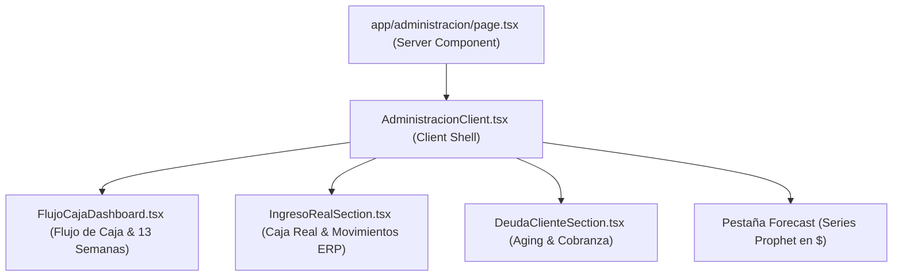

# 04 — Componentes y Vistas (Módulo de Administración y Finanzas)

## Mapa de Componentes y Páginas

```mermaid
graph TD
    Page["app/administracion/page.tsx (Server Component)"] --> Client["AdministracionClient.tsx (Client Shell)"]
    Client --> Flujo["FlujoCajaDashboard.tsx (Flujo de Caja & 13 Semanas)"]
    Client --> Ingreso["IngresoRealSection.tsx (Caja Real & Movimientos ERP)"]
    Client --> Deuda["DeudaClienteSection.tsx (Aging & Cobranza)"]
    Client --> Forecast["Pestaña Forecast (Series Prophet en $)"]
```

---

## Estructura de Componentes

### 1. `app/administracion/page.tsx`
- **Rol**: Server Component con `export const dynamic = 'force-dynamic'`.
- **Responsabilidad**:
  - Verifica sesión del usuario y permisos de Administrador (`user.isAdmin`).
  - Carga en paralelo mediante `Promise.all` el forecast de finanzas, ventas de los últimos 120 días, cartera de deudores, movimientos de cobros del ERP, compras comprometidas y saldos de caja.
  - Ejecuta las funciones puras `construirFlujoSemanal()`, `proyectarCaja()`, `proyectarCobros()`, `calcularAging()` y `semaforoClientes()`.

### 2. `AdministracionClient.tsx`
- **Rol**: Componente cliente principal con gestión de pestañas.
- **Pestañas disponibles**:
  1. **Flujo de Caja**: Visualización del gráfico de 13 semanas rodantes, balance de ingresos confirmados/proyectados vs. egresos de compras, y saldo acumulado.
  2. **Ingreso Real**: Análisis de la caja efectiva procesada en `cobros_erp`, desglose por método de pago (transferencia, cheque, efectivo) y comportamiento de pago por cliente.
  3. **Cobranza y Deuda**: aging de cartera, semáforo de riesgo por cliente y gestión de deudores vencidos.
  4. **Forecast Finanzas**: Curvas de proyección de ventas netas en CLP ($) por categoría y cliente individual.

### 3. Subcomponentes Especializados
- **`FlujoCajaDashboard.tsx`**: Renderiza el gráfico interactivo de barras/líneas de flujo de caja semanal, tarjetas de saldo bancario y filtros por cliente.
- **`IngresoRealSection.tsx`**: Tablas y tarjetas de cobranza real registrada en el ERP con comparativa de las últimas 4 semanas.
- **`DeudaClienteSection.tsx`**: Tarjetas de deuda vencida, gráfico de tramos de antigüedad (aging) y semáforo de riesgo.

### 4. Rutas y Vistas Complementarias
- **`/administracion/cargar-cobros`**: Interfaz de carga e importación del informe "Movimientos Cta. Cte." del ERP.
- **`/administracion/forecast`**: Vista ampliada del modelo de proyección financiera.

### 5. Calendario de entradas de la semana (1-oct-2026)
- **`CalendarioSemana.tsx`** (dentro de la pestaña Ingreso Real, bajo las dos cifras principales): grilla lunes→domingo con lo que entra cada día por concepto de venta — Cobranza de facturas, Mostrador PDV y BaseCamp —, selector de semana ISO (la pasada, la actual y 5 más), escenario "según comportamiento real" / "si pagan como pactaron" y detalle de qué clientes deberían pagar cada día. Los días ya pasados muestran lo que **entró de verdad** (`cobros_erp` por día, RPC `cobros_por_dia`), no lo esperado.
- **Lógica pura** en `lib/administracion/calendarioEntradas.ts` (`armarDatosCalendario` en el servidor, `armarSemana` en el navegador). Verificada contra datos reales: las facturas calendarizadas cuadran con `proyeccion.semanas` (diferencia $0-2 en ambos escenarios).

### 6. Pestaña Forecast: horizonte y resumen por ciclo (2-oct-2026)
- El gráfico y la tabla semanal de Cliente PDV, Restaurante BaseCamp y Compras muestran **8 semanas atrás y 16 adelante** (antes 8+8, que cortaban a fines de noviembre). El modelo ya proyecta 8 meses (hasta may-2027); el límite era solo esa ventana (`semanasForecastCliente` en `page.tsx`). 16 semanas desde hoy cubren todo diciembre con margen y se corren solas con el tiempo.
- Nueva tabla **"Proyección por ciclo (mes)"** (`resumenMensualForecast`, `lib/administracion/forecastMensual.ts`): por cada ciclo proyectado (24→23) muestra proyectado, rango del 80%, el **mismo ciclo del año anterior** (real) y la variación. Solo lista ciclos proyectados: el último ciclo real puede venir incompleto (BaseCamp se carga a mano).
- **Unidades:** Cliente PDV y Compras van en **neto**; Restaurante BaseCamp en **bruto** (boleta del Toteat con IVA incluido). Cada serie lo declara en `ForecastCliente.unidad` y la pantalla lo rotula (antes decía "montos netos" para todas, lo cual era falso para BaseCamp).
- Valores medidos el 2-oct-2026 para el ciclo de diciembre 2026 (24-nov a 23-dic): Cliente PDV $13,4 M neto (+6% vs dic-2025), BaseCamp $81,9 M bruto (+22% vs dic-2025). Octubre-2026 de BaseCamp sale +45% sobre el año anterior ($89,1 M vs $61,6 M): es el valor más sospechoso del modelo.

## Rediseño visual (5-oct-2026, skills de Emil Kowalski)

El módulo sigue siendo **claro a propósito** (pedido del usuario, 10-sep-2026). Reglas vigentes:

- **Una sola paleta y piezas comunes** en `app/administracion/tema.tsx`: `C` (papel cálido `#F5F2EC`, tinta `#1C1915`, acción en dorado oscuro `#87691A`; `blue` conserva el nombre pero es el color de acción), `Card`, `CardAlerta`, `Etiqueta`, `Cifra`, `Franja`. Antes había 8 copias de la paleta y 5 de Card/Etiqueta, distintas entre sí. No volver a definir `const C` en un archivo.
- **CSS del módulo** en `globals.css`, bloque `.adm-root`: respuesta al presionar (`scale(0.97)`), hover sólo con mouse, foco visible, fundido de 140 ms al cambiar de pestaña, subrayado animado de pestañas, campos legibles (la regla global de inputs es del tema oscuro) y 16 px en pantallas táctiles.
- **Encabezado compacto**: volver + "Administración y Finanzas" + la pregunta de la pestaña (`PREGUNTA_TAB`), chip de ciclo/modelo y Asistente; pestañas subrayadas.
- **Cifras en franja** (`<Franja>`, flex con divisores: la última fila se estira, sin huecos).
- **Deudores**: la tabla muestra los 20 de mayor deuda con "Ver los N deudores" (Cobranza pasó de 12.700 a 5.500 px).
- **Gráficos**: hex de `C` (Recharts usa atributos SVG); leyendas en `C.muted` (el color de la serie no se leía sobre blanco).
- **Carga**: `loading.tsx` claro con la forma del módulo (el negro anterior destellaba).
- **Datos**: la carga vive en `cargarDatos.ts` (`cargarDatosAdministracion`); `page.tsx` sólo verifica que sea administrador. El banco `/dev/administracion` (sólo desarrollo) muestra el módulo con datos reales sin login para revisar el diseño.
