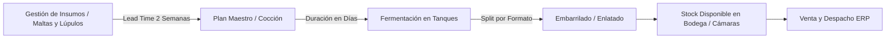

# 01 — Resumen Ejecutivo y Dominio de Negocio (Módulo de Producción)

## Visión General
El módulo de **Producción** (`app/produccion`) gestiona la planificación operativa, previsión de demanda (Forecasting), cálculo de Stock de Seguridad, ocupación física de la planta de fermentación (Gantt de Tanques), Plan Maestro de Cocciones y la Planificación de Necesidad de Materiales e Insumos (MRP).

El negocio produce dos categorías principales de producto:
1. **Cerveza** (estilos clásicos como *Mocho English*, *Fisura*, *La Barra APA*, *Arboretum*, *Descenso West Coast IPA*, *Aguas Blancas*, entre otros).
2. **Kombucha** (*Berry Menta*, *Maracuyá Cardamomo*, *Maqui*, *Lemon*, *Lupulada*, *Detox*).

---

## 1. El Ciclo Comercial Interno (Regla del 24 al 23)
A diferencia del calendario civil (1 al 31 de cada mes), el ciclo comercial interno de producción y ventas corre del **día 24 del mes anterior al día 23 del mes que le da nombre**.

- **Ejemplo**: El ciclo `"2026-09-01"` (Septiembre) agrupa exactamente las ventas realizadas desde el **24 de Agosto al 23 de Septiembre**.
- **Sin superposición**: Todo día del año pertenece a exactamente un ciclo. `día <= 23` pertenece al ciclo en curso que cierra; `día >= 24` pertenece al ciclo siguiente que inicia.
- **Motivo de Negocio**: Coincide con la cadencia de cierre comercial y metas de ventas. Elimina distorsiones en los modelos de Machine Learning / Prophet.

---

## 2. Clasificación de Formatos y Envases

### Buckets de Envase (`EnvaseBucket`)
- `barril_30`: Barril de 30 Litros.
- `barril_50`: Barril de 50 Litros.
- `lata`: Agrupa latas de **354 ml** y **473 ml** (decisión de negocio sep 2026: Prophet entrena un solo modelo sobre la demanda combinada de latas).
- `otros`: Growlers, pintas o recargas en local. Excluido del stock de seguridad y del forecast por formato.

### Familia de Envase (`FamiliaEnvase`)
- **`barril`**: Agrupa `barril_30` y `barril_50`.
  - **Regla Crítica**: Los barriles de 50L son para traslados internos a BaseCamp (local propio). Si se agotan de 50L, se cubren con 30L. **No generan quiebre de stock independiente**; se cuentan juntos para evitar falsas alarmas de quiebre.
- **`lata`**: Formato independiente. Un pedido de latas **nunca** se puede sustituir con barriles.

---

## 3. Catálogo de Líneas Fijas vs. Experimentales

El catálogo se divide en dos prioridades estratégicas:
1. **Líneas Fijas (`LINEAS_FIJAS`)**: Catálogo estable que **nunca debe quebrar stock**.
   - *Kombuchas*: Berry Menta, Maracuyá Cardamomo, Maqui, Lemon, Lupulada, Detox.
   - *Cervezas*: Mocho English, Fisura, La Barra APA, Arboretum, Descenso West Coast IPA, Aguas Blancas Hazy IPA.
   - **Comportamiento en UI**: Tienen prioridad absoluta en las alarmas de quiebre de stock y sugerencias del Plan Maestro.
2. **Líneas Experimentales / Rotativas**: Ediciones limitadas o puntuales de menor prioridad de reposición.

---

## 4. Flujo Físico y Operativo de Producción

1. **Gestión de Insumos**: Lead time de **2 semanas** con proveedores para tener la materia prima en planta antes de cocer.
2. **Cocción & Fermentación**: El lote ocupa un tanque (fermentador) durante $N$ días corridos de fermentación (configurado por producto).
3. **Split de Tanque**: Al salir del tanque, el volumen a granel se distribuye inteligentemente entre barriles (30L/50L) y latas respondiendo a las necesidades de reposición de cada formato.
4. **Almacenamiento**: Pasa a las cámaras de producto terminado (*Frío Planta*, *Latas FIFO*).
