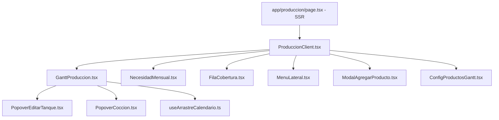

# 04 — Componentes y Vistas (Módulo de Producción)

## Arquitectura de Componentes

La interfaz del módulo de Producción se organiza mediante un **Server Component de entrada** (`page.tsx`) que ejecuta todas las consultas pesadas a Supabase, calcula ritmos de venta e hidrata el estado para el **Client Component principal** (`ProduccionClient.tsx`).

---

## Detalle de Archivos de la Vista (`app/produccion/`)

| Archivo | Responsabilidad Principal |
| :--- | :--- |
| **`page.tsx`** | Server Component. Realiza fetching en paralelo a Supabase, calcula el avance del ciclo en curso (24 al 23), resuelve nombres de catálogo ERP y genera el trailing de 28 días sobre días hábiles. |
| **`ProduccionClient.tsx`** | Orquestador de la UI cliente. Gestiona pestañas (*Plan Maestro*, *Gantt*, *Forecasting*, *MRP Insumos*, *Stock de Seguridad*), filtros por categoría/línea fija y mutaciones a Supabase. |
| **`GanttProduccion.tsx`** | Gráfica de ocupación temporal de tanques fermentadores. Permite visualizar y arrastrar bloques de lotes programados o en fermentación. |
| **`NecesidadMensual.tsx`** | Vista matricial de MRP. Calcula necesidades brutas y netas de maltas, lúpulos y levaduras según el Plan Maestro activo. |
| **`FilaCobertura.tsx`** | Componente visual para mostrar días de cobertura, disponible vs. punto de reorden y banderas de quiebre por producto/formato. |
| **`MenuLateral.tsx`** | Menú lateral de navegación rápido dentro de las secciones de producción. |
| **`ConfigProductosGantt.tsx`** | Panel de configuración de parámetros por producto ($N$ días de fermentación, litros objetivo, color en Gantt). |
| **`ModalAgregarProducto.tsx`** | Formulario modal para programar una nueva cocción en la tabla `plan_produccion`. |
| **`PopoverCoccion.tsx`** | Tooltip/Popover emergente al hacer clic en un lote del Gantt. |
| **`PopoverEditarTanque.tsx`** | Modificación manual de capacidades o estado de tanques en planta. |
| **`useArrastreCalendario.ts`** | Custom Hook para manejo de arrastre, desplazamiento horizontal y snap-to-grid de fechas en el Gantt. |
| **`tema.ts`** | Constantes de diseño y paleta de colores para los estados de tanques y niveles de severidad. |

---

## Secciones Principales de la UI (`ProduccionClient.tsx`)

1. **Plan Maestro & Alarmas de Quiebre**: Muestra las sugerencias automáticas prioritarias (Líneas Fijas primero) y la cola editable de cocciones (`plan_produccion`).
2. **Planta & Ocupación de Tanques (Gantt)**: Muestra el % de ocupación real de la sala de cocción ($\text{Litros ocupados} / \text{Capacidad total}$), el split asignado a barriles/latas y la proyección temporal por fermentador.
3. **Previsión de Demanda (Forecasting)**: Gráficos de tendencias mensuales Prophet, bandas de confianza y métricas de error (MAPE / MAE) comparadas contra las ventas MTD.
4. **Inventario & Stock de Seguridad**: Comparación de inventario físico disponible en cámaras vs. Puntos de Reorden y Colchones requeridos.
5. **MRP Insumos**: Proyección de compra y disponibilidad de materias primas necesarias para cumplir la cola de cocciones.
