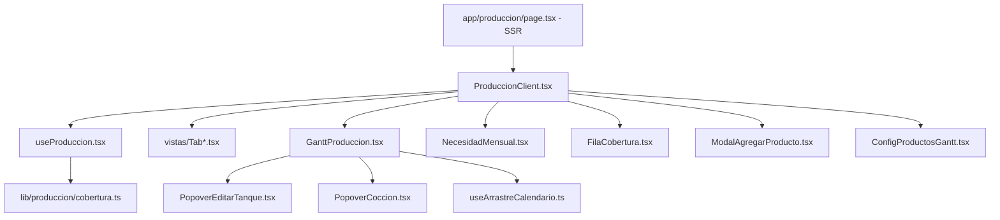

# 04 — Componentes y Vistas (Módulo de Producción)

## Arquitectura de Componentes

La interfaz del módulo de Producción se organiza mediante un **Server Component de entrada** (`page.tsx`) que ejecuta todas las consultas pesadas a Supabase, calcula ritmos de venta e hidrata el estado para el **Client Component principal** (`ProduccionClient.tsx`).

```mermaid
graph TD
    page.tsx[app/produccion/page.tsx - SSR] --> ProduccionClient[ProduccionClient.tsx]
    ProduccionClient --> Hook[useProduccion.tsx]
    ProduccionClient --> Vistas[vistas/Tab*.tsx]
    Hook --> Motor[lib/produccion/cobertura.ts]
    ProduccionClient --> Gantt[GanttProduccion.tsx]
    ProduccionClient --> MRP[NecesidadMensual.tsx]
    ProduccionClient --> Cobertura[FilaCobertura.tsx]
    ProduccionClient --> ModalPlan[ModalAgregarProducto.tsx]
    ProduccionClient --> ConfigGantt[ConfigProductosGantt.tsx]
    Gantt --> PopoverTanque[PopoverEditarTanque.tsx]
    Gantt --> PopoverCoccion[PopoverCoccion.tsx]
    Gantt --> HookDrag[useArrastreCalendario.ts]
```

---

## Detalle de Archivos de la Vista (`app/produccion/`)

| Archivo | Responsabilidad Principal |
| :--- | :--- |
| **`page.tsx`** | Server Component. Realiza fetching en paralelo a Supabase, calcula el avance del ciclo en curso (24 al 23), resuelve nombres de catálogo ERP y genera el trailing de 28 días sobre días hábiles. |
| **`ProduccionClient.tsx`** | Cascarón: encabezado, 5 pestañas (Hoy, Demanda, Plan, Planta, Compras) y modales compartidos. El estado y los cálculos están en `useProduccion.tsx`. |
| **`GanttProduccion.tsx`** | Gráfica de ocupación temporal de tanques fermentadores. Permite visualizar y arrastrar bloques de lotes programados o en fermentación. |
| **`NecesidadMensual.tsx`** | Vista matricial de MRP. Calcula necesidades brutas y netas de maltas, lúpulos y levaduras según el Plan Maestro activo. |
| **`FilaCobertura.tsx`** | Componente visual para mostrar días de cobertura, disponible vs. punto de reorden y banderas de quiebre por producto/formato. |
| **`ConfigProductosGantt.tsx`** | Panel de configuración de parámetros por producto ($N$ días de fermentación, litros objetivo, color en Gantt). |
| **`ModalAgregarProducto.tsx`** | Formulario modal para programar una nueva cocción en la tabla `plan_produccion`. |
| **`PopoverCoccion.tsx`** | Tooltip/Popover emergente al hacer clic en un lote del Gantt. |
| **`PopoverEditarTanque.tsx`** | Modificación manual de capacidades o estado de tanques en planta. |
| **`useArrastreCalendario.ts`** | Custom Hook para manejo de arrastre, desplazamiento horizontal y snap-to-grid de fechas en el Gantt. |
| **`tema.ts`** | Constantes de diseño y paleta de colores para los estados de tanques y niveles de severidad. |

---

## Rediseño del 4-oct-2026: cinco pestañas y paleta de Ventas

**Estructura de archivos**
- `page.tsx` (servidor): consultas, ritmos y armado de props. Desde el rediseño además carga `lotesCerrados` (8 semanas), `envase` (`produccion_envase`), `historialStock` (`stock_productos_diario`, líneas fijas) y `mlLataPorProducto`.
- `useProduccion.tsx`: TODO el estado y los cálculos del cliente (antes vivían en un `ProduccionClient.tsx` de 6.923 líneas). Devuelve un objeto `p` que reciben las vistas.
- `ProduccionClient.tsx`: cascarón con encabezado, pestañas y los modales compartidos (Programar cocción, Cerrar lote, editar tanque, configurar productos, agregar producto, fantasma del arrastre).
- `navegacion.ts`: las 5 pestañas y la pregunta que contesta cada una (se muestra como título).
- `vistas/TabHoy.tsx`, `TabDemanda.tsx`, `TabPlan.tsx`, `TabPlanta.tsx`, `TabCompras.tsx` + `vistas/ui.tsx` (Seccion, Kpi, ChipEstado, BarraCobertura, Pastillas, ComoSeCalcula, fFecha).
- `compartido.tsx`: formatos y componentes chicos (FormNuevoLote, ModalConfirmarLoteGrupo, ChipDesviacion). `ModalCerrarLote.tsx`: litros reales al terminar un lote.
- Se eliminó `MenuLateral.tsx`: el módulo usa pestañas arriba, como Administración.

| Pestaña | Pregunta | Contenido |
|---|---|---|
| Hoy | ¿Cómo estamos y qué hacer esta semana? | 4 cifras (líneas fijas en riesgo, cocciones de la semana, en fermentación, venta del ciclo), "Qué hacer ahora" con botones (lotes vencidos, urgentes → Programar, insumos por pedir, lotes por terminar), semana en planta y tanques, semáforo de líneas fijas, ¿se cumple el plan?, días sin stock, compra proyectada y avisos del modelo |
| Demanda | ¿Cuánto vamos a vender? | El forecast de siempre (gráfico, Litros / $ Neto, ver el modelo, detalle por producto y envase). La calculadora de cobertura pasó a Plan |
| Plan | ¿Cuánto y cuándo producir? | Tabla única del motor de cobertura con selector "Cubrir hasta" (ciclos), filtros por estado/categoría/líneas fijas y detalle por formato; Necesidad mensual (confirmar litros al plan); Inventario por cámara plegable |
| Planta | ¿Qué hay en cada tanque y qué se cocina? | Lotes vencidos (Sí se cocinó / Pasar a hoy / No se hará), Gantt + proyección de carga, split de envasado, cola del plan maestro (Iniciar → Terminar), lotes cerrados plan vs. real |
| Compras | ¿Qué compramos, cuánto y cuánto cuesta? | 4 cifras, plan de los próximos 3 ciclos (litros, latas, insumos, envase, total + gráfico), envase con precio/stock editables, presupuesto de insumos del calendario (Excel), stock de insumos y compra sugerida (MRP) |

**Colores**: tokens `--p-*` en `globals.css` (bloque "COLOR — módulo de Producción"), derivados de los de Ventas (`--bg`, `--surface`, dorado, crema) con versión para `[data-theme="light"]`. Acción principal: clase `.prod-primario` (degradado dorado con tinta oscura, igual que `.btn-cta`). Gráficos y Gantt: hex fijos de `tema.ts` (`COLORS.primario`, `contraste`, `kombucha`, `rejilla`, `eje`) porque Recharts los pasa como atributos SVG. Los popovers del Gantt son siempre carbón (`#1C1C1C`).

**Banco de pruebas**: `/dev/produccion/completo` (sólo en desarrollo) monta el módulo entero con datos inventados (`app/dev/produccion/completo/fixturesCompletos.ts`) para revisar las cinco pestañas en modo oscuro y claro sin login.

## Secciones de la UI anteriores al rediseño (histórico)
 (`ProduccionClient.tsx`)

1. **Plan Maestro & Alarmas de Quiebre**: Muestra las sugerencias automáticas prioritarias (Líneas Fijas primero) y la cola editable de cocciones (`plan_produccion`).
2. **Planta & Ocupación de Tanques (Gantt)**: Muestra el % de ocupación real de la sala de cocción ($\text{Litros ocupados} / \text{Capacidad total}$), el split asignado a barriles/latas y la proyección temporal por fermentador.
3. **Previsión de Demanda (Forecasting)**: Gráficos de tendencias mensuales Prophet, bandas de confianza y métricas de error (MAPE / MAE) comparadas contra las ventas MTD.
4. **Inventario & Stock de Seguridad**: Comparación de inventario físico disponible en cámaras vs. Puntos de Reorden y Colchones requeridos.
5. **MRP Insumos**: Proyección de compra y disponibilidad de materias primas necesarias para cumplir la cola de cocciones.

## Forecast en dinero neto (1-oct-2026)

En la pestaña **Forecasting** (`ProduccionClient.tsx`) hay un botón **Litros | $ Neto** junto al gráfico principal. Solo cambia lo que se MUESTRA: gráfico (serie, rango, ritmo, eje Y y tooltip), panel "Ver el modelo", tarjetas "Vendido este mes / A este ritmo / El modelo proyectó" y la tabla "Detalle por producto y envase". El modelo, el stock de seguridad, el Gantt y la **Calculadora de Cobertura siguen en litros** (son cuentas operativas). Si una serie no tiene precio, el botón avisa y se queda en litros.

## Pulido de movimiento y aspecto (4-oct-2026, skills de Emil Kowalski)

Reglas que ya están aplicadas y hay que respetar al tocar el módulo:

- **Movimiento** (`globals.css`, bloque "MOVIMIENTO — módulo de Producción"): curvas `--p-ease-out` / `--p-ease-in-out` (las de Emil, no las del navegador); nunca `ease-in`. Cambiar de pestaña = fundido de 140 ms sin desplazamiento ni escalonado (navegación diaria). Todo hover que mueve algo va detrás de `@media (hover: hover) and (pointer: fine)`. Modales: `.prod-modal` (scale 0.96 → 1, 200 ms; en celular suben como hoja) y `.prod-scrim`; detalles plegables: `.prod-pliegue` (anima `grid-template-rows`). Reducir movimiento = fundido corto, no cero.
- **Excepción documentada**: el pulso infinito de un bloque del Gantt en conflicto (`.prod-gantt-alerta`) se mantiene a propósito: marca un plan que no se puede ejecutar.
- **Móvil**: controles con `touch-action: manipulation` y sin selección de texto; campos en 16 px con puntero táctil (si no, iOS hace zoom); `overscroll-behavior: contain` y borde seguro inferior en el contenedor de scroll.
- **Aspecto**: cifras en una sola `Franja` (no 4 tarjetas iguales); estado con punto o chip, nunca con franja de color al costado; el degradado dorado (`.prod-primario`) es para UNA acción principal por pantalla, las acciones de fila usan `.prod-accion`; sin ícono dorado delante de cada título; números con `.prod-cifra` (tracking negativo y cifras tabulares).
- **Textos**: tuteo chileno (no voseo) y `pl(n, 'uno', 'varios')` para plurales.
- **Datos que faltan**: una pantalla nunca afirma "todo bien" si no hay datos (Hoy y Compras muestran "—" y dicen qué falta).
- **Banco de pruebas** `/dev/produccion/completo?data=normal|peor|vacio|uno`: el peor caso usa nombres largos reales y más lotes; sirve de regresión de `break-ui`.

## Gantt rápido y amable (5-oct-2026)

Lo que hacía lento mover y borrar, y cómo quedó (no reintroducir):

- **Mover es optimista** (`moverLoteEnGantt` en `useProduccion.tsx`): el bloque cambia de lugar al soltar; si el PATCH falla, vuelve y se avisa.
- **Google Calendar no bloquea la respuesta**: `POST/PATCH /api/produccion/plan` sincronizan el evento con `after()` de Next.
- **Sin `router.refresh()` tras un cambio exitoso** (mover, cambiar estado, reordenar, agregar): recargaba la página entera. Las reversiones son por lote (`setPlan(p => …)`), nunca "volver a la foto anterior".
- **Quitar = un clic o Supr + "Deshacer" 6 s** (`quitarLoteConDeshacer` / `deshacerQuitar`, aviso en `ProduccionClient`). Ya no hay doble clic de confirmación. La X se ve con hover, con foco de teclado y siempre en pantallas táctiles (`.prod-gantt-quitar`).
- **Arrastre fuera de React** (`useArrastreCalendario.ts`): el estado vive en un almacén propio (`StoreArrastre` + `useEstadoArrastre`) que sólo leen el Gantt y el fantasma; cambia sólo al cambiar de celda; el fantasma se mueve escribiendo `transform` por ref. `FilaTanque`, `BloqueCoccion` y `FilaCobertura` están memorizados y la carga del arrastre sólo llega a la fila de origen y a la de destino. Medido en el banco (modo desarrollo): 57 de 60 movimientos bajo 16 ms, típico 0,2 ms.
- **Durante el arrastre los bloques no capturan el puntero** (`[data-arrastrando]`): antes no se podía soltar sobre un día ocupado por otro bloque, ni siquiera sobre el propio.
- **Contorno de destino** con el largo real del lote; rojo con "Se pisa con otra cocción" o "No cabe en este tanque".
- **Auto-desplazamiento**: contenedores con `data-autoscroll="x|y"` (la grilla del Gantt y el `main` del módulo) se desplazan solos cuando el puntero se acerca al borde.
- Bug corregido: al arrastrar se apagaban todos los bloques del mismo producto; ahora se compara por `idBloque`.
