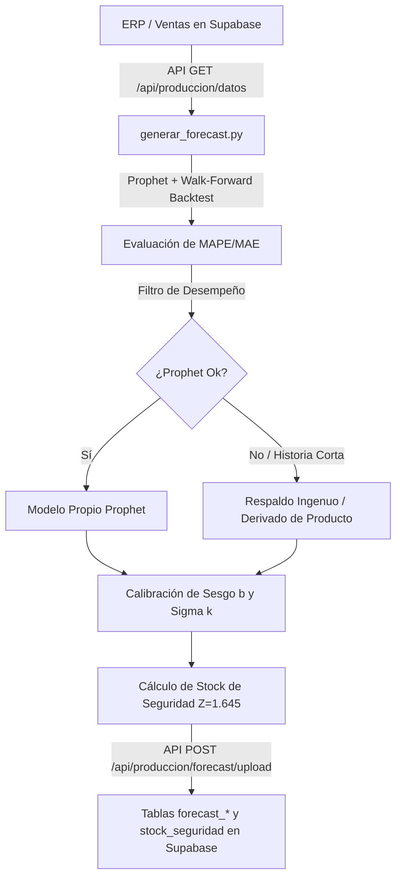

# 05 — Scripts de IA, Machine Learning y Forecasting (Módulo de Producción)

## Visión General del Pipeline ML

El módulo de Producción integra un pipeline de previsión de demanda basado en **Facebook Prophet** (Python), ejecutado de forma semanal vía **GitHub Actions** o manualmente local.



---

## 1. Archivos Clave del Pipeline (`scripts/forecast/`)

- **`generar_forecast.py`** (~1000 líneas Python):
  - Proyecta demanda a **8 meses** para 4 niveles (`general`, `producto`, `envase`, `producto_envase`).
  - No lee directamente de la base de datos: consulta `GET /api/produccion/datos` para asegurar que las reglas de negocio TypeScript (limpieza de mermas, clientes excluidos) sean la única fuente de verdad.
  - Sube los resultados a `POST /api/produccion/forecast/upload` autenticado por `UPLOAD_SECRET_FORECAST`.
- **`calibrar_sigma.py`**:
  - Calibra el factor $k$ (ancho de la banda de confianza de Prophet vs desvío real fuera de muestra) y el factor $b$ (sesgo medio de sobre/subestimación).
- **`calibracion_sigma.json`**:
  - Parámetros persistidos de calibración de sesgo y sigma por serie y nivel.

---

## 2. Parámetros Críticos del Modelo Prophet

| Parámetro | Valor | Descripción |
| :--- | :--- | :--- |
| `HORIZONTE_MESES` | 8 | Meses hacia el futuro proyectados por el modelo. |
| `MIN_MESES_FORECAST` | 6 | Mínimo número de meses de historial requeridos para intentar Prophet. |
| `MESES_BACKTEST` | 6 | Pliegues del backtest *walk-forward* a 1 mes adelante. |
| `MESES_INACTIVIDAD` | 6 | Si una serie no vende en 6 meses, se marca inactiva y no se proyecta. |
| `Z_SERVICIO` | 1.645 | Nivel de servicio del 95% para el Stock de Seguridad (una cola). |
| `Z_BANDA_PROPHET` | 1.2816 | Banda de confianza del 80% (`interval_width=0.8`). |
| `LEAD_TIME_SEMANAS` | Cerveza: 4, Kombucha: 3 | Tiempo de cocción y fermentación en planta. |
| `LEAD_TIME_INSUMOS_SEMANAS` | 2 | Tiempo de compra y recepción de materias primas con proveedores. |

---

## 3. Respaldo Ingenuo y Series Derivadas

Para evitar los fallos clásicos de los modelos de tendencia cuando la venta se da vuelta o colapsa:

1. **Backtest Walk-Forward**: Evaluado pliegue a pliegue a 1 mes adelante para medir el MAPE real fuera de muestra.
2. **Respaldo Ingenuo (`VENTANA_INGENUA_MESES = 3`)**:
   - Si Prophet obtiene un $MAPE > 100\%$ o su tendencia colapsa a 0 mientras el producto sigue vendiendo, el script activa un promedio móvil plano de los últimos 3 meses.
   - Evita quiebres de stock provocados por inercias pasadas del modelo.
3. **Derivación de Formatos (`producto_envase`)**:
   - Si una combinación producto × envase tiene poca historia propia o un MAPE propio muy alto, su proyección se **deriva del forecast del producto padre** aplicando la proporción reciente de ese formato.

---

## 4. Ejecución del Script

### Localmente
```bash
python scripts/forecast/generar_forecast.py
```

### En Producción (GitHub Actions)
El workflow `.github/workflows/forecast-produccion.yml` se ejecuta semanalmente y actualiza automáticamente el forecast y stock de seguridad en Supabase.
